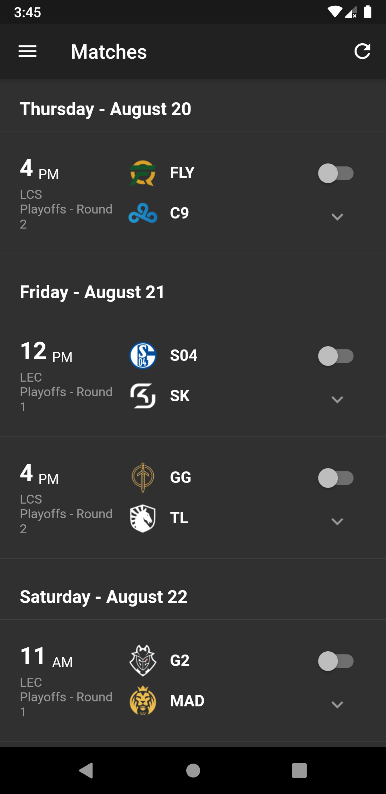
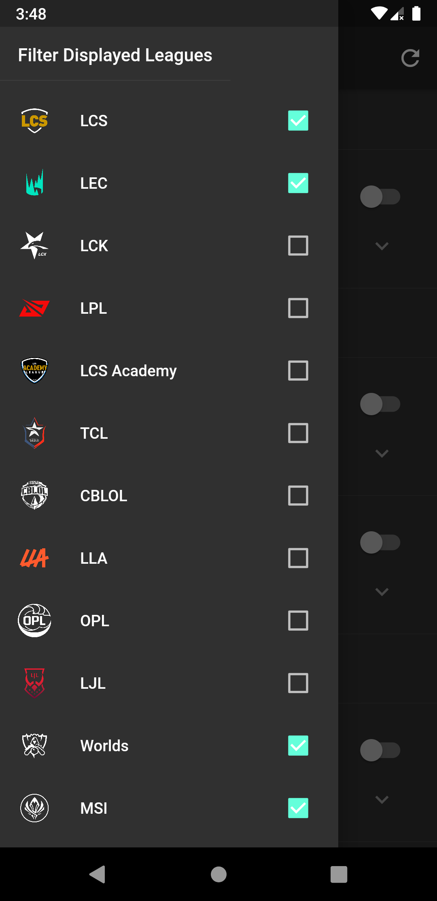
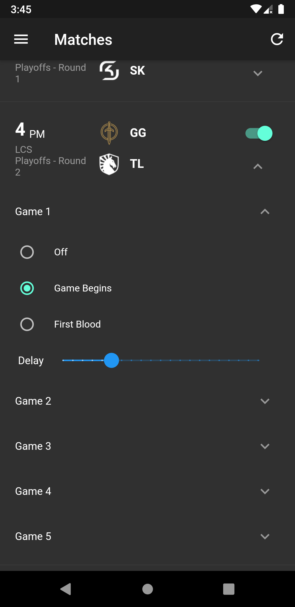
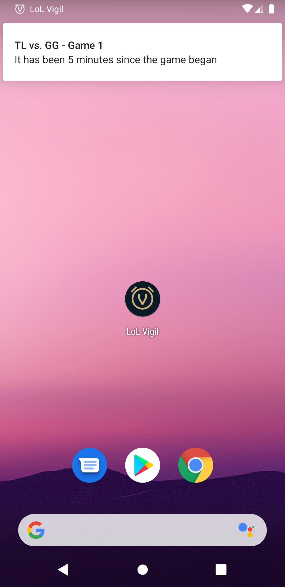
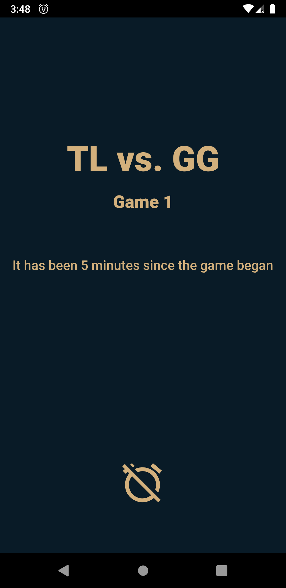

<!-- PROJECT LOGO -->
 

  

  <h3 align="center">LoL Vigil</h3>

  

    An Android app that sends real-time alarm notifications for League of Legends Esports games.
  

<!-- TABLE OF CONTENTS -->
## Table of Contents

* [About the Project](#about-the-project)
  * [Screenshots](#screenshots)
  * [Built With](#built-with)
* [Getting Started](#getting-started)
* [License](#license)

<!-- ABOUT THE PROJECT -->
## About The Project

This Android app allows users to request alarms for League of Legends Esports matches. Setting an alarm in the app will send a request to the AWS backend to save the alarm. The backend checks the status of live games in 1-minute intervals. When the status of a game matches an alarm's configuration, then a message will be sent to the user's device. Once the user's device receives the message, an alarm will begin to ring. 

> This application relies on [LoLEsport's unofficial API](https://vickz84259.github.io/lolesports-api-docs/). This API returns information that is <strong>ahead</strong> of the live broadcast by a few minutes. In addition, the API may change at any time and break this application.

### Screenshots

<strong>Matches & Leagues Sidebar</strong>

The homescreen shows a list of all matches of the leagues you want to view.

 
  

<strong>Set Alarms</strong>

You can set an alarm for a match by turning the alarm switch "on" and then further customizing your alarm for each individual game to your preference. 

The current available alarm triggers include: 

<ol>
<li>Off: You will not receive an alarm for this game</li>
<li>Game Begins: You will receive an alarm when the players load into the game</li>
<li>First Blood: You will receive an alarm when the first kill has been made</li>
</ol>

A delay is also available. This will delay the alarm to [0-20] minutes after the trigger has occured.

  

<strong>Receiving an alarm</strong>

If the device is unlocked when the alarm is received, then a notification will be displayed. The alarm will start ringing with the device's set alarm sound. The alarm can be turned off by swiping away the notification.

If the device is locked, then an alarm screen will wake the device as well. This type of alarm can be dismissed by either pressing the dismiss alarm icon or swiping away the notification.

 

### Built With

- [Mobile App](/lol_vigil_mobile)
  - Dart
  - Kotlin
- [Backend](/backend)
  - Go

<!-- GETTING STARTED -->
## Getting Started

This repo is a monorepo containing the code for both the mobile application and the backend. Navigate to their respective folders for instructions on getting started.

<!-- LICENSE -->
## License

Distributed under the MIT License. See `LICENSE` for more information.

<!-- MARKDOWN LINKS & IMAGES -->
<!-- https://www.markdownguide.org/basic-syntax/#reference-style-links -->
[logo]: lol_vigil_mobile/assets/icon/LoL-Vigil.png
