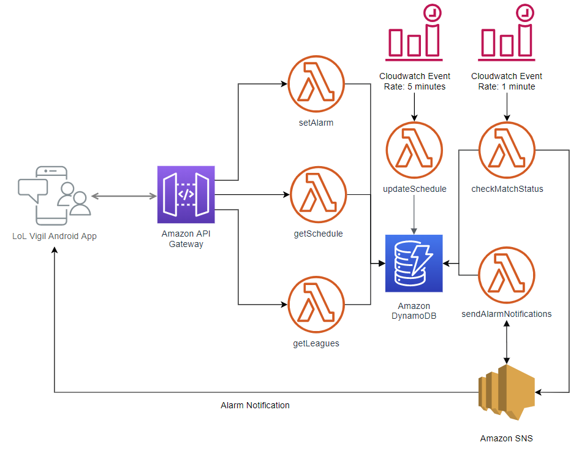

# LoL Vigil Backend

## System Design
The backend for LoL Vigil is 100% on AWS. 

### Diagram



### Lambda Functions

- updateSchedule: Pulls the schedules from LoLEsports unofficial API and updates both Schedule and Matches tables in DynamoDB.
- getSchedule: Gets a page from the Schedule table.
- getLeagues: Gets a list of leagues (tournaments) from LoLEsports unofficial API.
- setAlarm: Writes the device's game alarms for a match to gameAlarms in the Matches table.
- checkMatchStatus: Uses the LoLEsports unofficial API to get the live matches and then updates the status of the match in the Matches table. If the match is in progress, then it will publish a message to a SNS topic to trigger the sendAlarmNotifications function.
- sendAlarmNotifications: Compares the state of a game (from the SNS trigger message) with the gameAlarms found in the Matches table. If the conditions match and the game alarm hasn't been triggered for the device, then SNS is used to send a GCM message to the device.

### DynamoDB Tables Schemas
```bash
├── Schedule                                <-- Table
|   └── page                                <-- Key: Page index
|       └── schedule                        <-- Raw schedule string
|
└── Matches                                 <-- Table
    └── id                                  <-- Key: Match ID
        ├── gameAlarms                    
        |   └── 1                           <-- Game 1 alarms
        |       └── deviceID                <-- Game alarm for deviceID
        |           ├── hasBeenTriggered 
        |           ├── trigger              
        |           └── delay                 
        ├── gameTimestamps                 
        |   └── 1                           <-- Game 1 timestamps
        |       ├── gameBegins            
        |       └── firstBlood                 
        ├── startTime                       <-- Scheduled start time of match 
        ├── state                           <-- Status of match ["unstarted", "inProgress", "completed"]
        ├── strategy                     
        |   ├── type                        <-- Match Type ["bestOf"]
        |   └── count                       <-- Number of games (1-5)         
        └── teams                        
            ├── A                           <-- Name of team 1
            └── B                           <-- Name of team 2  
```

## Requirements

* AWS CLI already configured with Administrator permission
* [Docker installed](https://www.docker.com/community-edition)
* [Golang](https://golang.org)
* SAM CLI - [Install the SAM CLI](https://docs.aws.amazon.com/serverless-application-model/latest/developerguide/serverless-sam-cli-install.html)
* AWS account with a [SNS Platform Application](https://aws.amazon.com/premiumsupport/knowledge-center/create-android-push-messaging-sns/) (Used to send messages to devices via. Google Cloud Messaging)
* [Local instance of DynamoDB](https://docs.aws.amazon.com/amazondynamodb/latest/developerguide/DynamoDBLocal.DownloadingAndRunning.html) 

## Setup process

### Installing dependencies & building the target 

We use the built-in `sam build` to automatically download all the dependencies and package our build target.   
Read more about [SAM Build here](https://docs.aws.amazon.com/serverless-application-model/latest/developerguide/sam-cli-command-reference-sam-build.html) 

### Local development

**Invoking function locally through local API Gateway**
```shell
make testUpdateSchedule
```
This will invoke the updateSchedule function and print out any outputs to your shell.


You can also start a local server for the Lambda functions:
```shell
make run
```
If the previous command ran successfully you should now be able to hit local endpoints to invoke your functions `http://localhost:3000/get_schedule`

**SAM CLI** is used to emulate both Lambda and API Gateway locally and uses our `template.yaml` to understand how to bootstrap this environment (runtime, where the source code is, etc.) - The following excerpt is what the CLI will read in order to initialize an API and its routes:

```yaml
...
Events:
    REST:
        Type: Api # More info about API Event Source: https://github.com/awslabs/serverless-application-model/blob/master/versions/2016-10-31.md#api
        Properties:
            Path: /get_schedule
            Method: get
```

## Using local instance of DynamoDB

Initialize a Docker container for DynamoDB
```shell
make createDb
```

Create the Matches and Schedule tables
```shell
make startdb
```

## Packaging and deployment

AWS Lambda Golang runtime requires a flat folder with the executable generated on build step. SAM will use `CodeUri` property to know where to look up for the application:

```yaml
...
UpdateScheduleFunction:
    Type: AWS::Serverless::Function
    Properties:
      CodeUri: ./update_schedule.zip
      ...
```

To deploy your application for the first time, run the following in your shell:

```bash
sam deploy --guided
```

The command will package and deploy your application to AWS, with a series of prompts:

* **Stack Name**: The name of the stack to deploy to CloudFormation. This should be unique to your account and region, and a good starting point would be something matching your project name.
* **AWS Region**: The AWS region you want to deploy your app to.
* **Confirm changes before deploy**: If set to yes, any change sets will be shown to you before execution for manual review. If set to no, the AWS SAM CLI will automatically deploy application changes.
* **Allow SAM CLI IAM role creation**: Many AWS SAM templates, including this example, create AWS IAM roles required for the AWS Lambda function(s) included to access AWS services. By default, these are scoped down to minimum required permissions. To deploy an AWS CloudFormation stack which creates or modified IAM roles, the `CAPABILITY_IAM` value for `capabilities` must be provided. If permission isn't provided through this prompt, to deploy this example you must explicitly pass `--capabilities CAPABILITY_IAM` to the `sam deploy` command.
* **Save arguments to samconfig.toml**: If set to yes, your choices will be saved to a configuration file inside the project, so that in the future you can just re-run `sam deploy` without parameters to deploy changes to your application.

You can find your API Gateway Endpoint URL in the output values displayed after deployment.

After your first deploy, you can use the following command to deploy:

```bash
make deploy
```


# Appendix

### Golang installation

Please ensure Go 1.x (where 'x' is the latest version) is installed as per the instructions on the official golang website: https://golang.org/doc/install

A quickstart way would be to use Homebrew, chocolatey or your linux package manager.

#### Homebrew (Mac)

Issue the following command from the terminal:

```shell
brew install golang
```

If it's already installed, run the following command to ensure it's the latest version:

```shell
brew update
brew upgrade golang
```

#### Chocolatey (Windows)

Issue the following command from the powershell:

```shell
choco install golang
```

If it's already installed, run the following command to ensure it's the latest version:

```shell
choco upgrade golang
```
